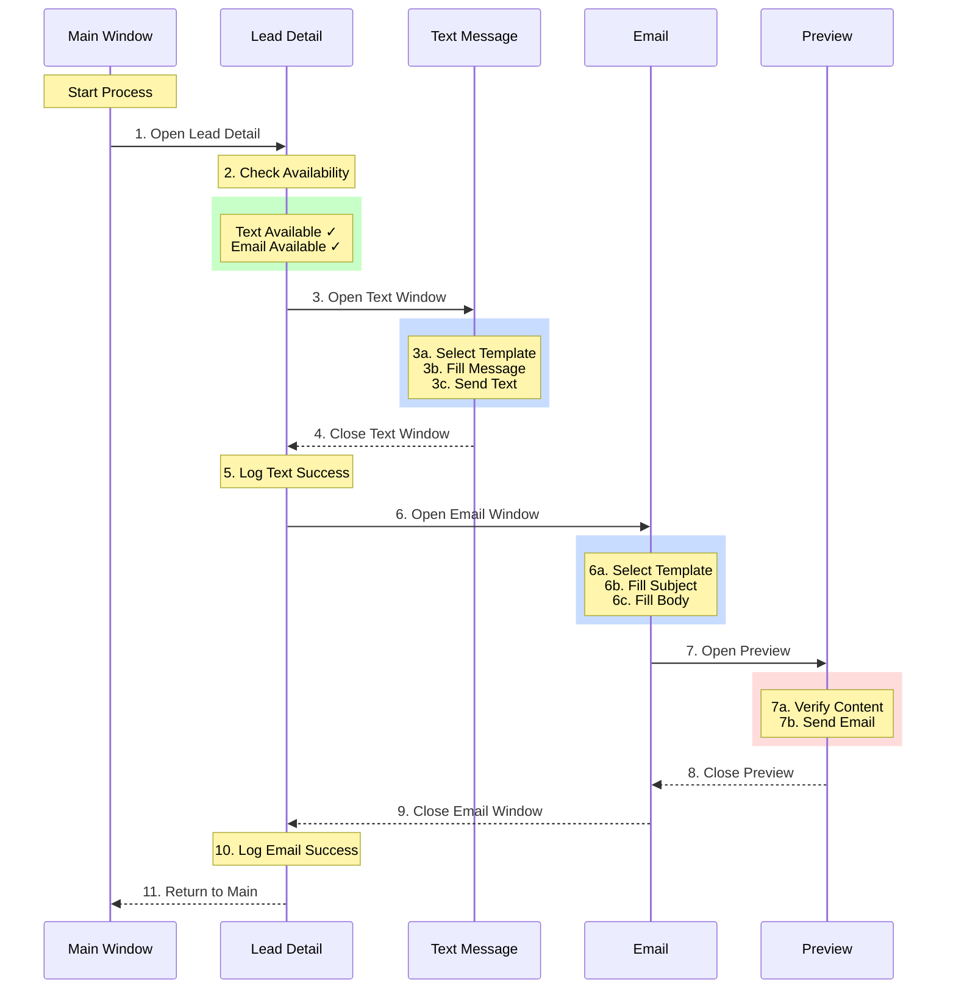

# Dual Contact Method Process Flow

## Visual Sequence


## Detailed Process Breakdown

### 1. Initial Lead Access
```python
# Store main window handle
main_window = driver.current_window_handle

# Open lead detail
lead_element.click()
wait.until(EC.new_window_is_opened)
detail_window = [h for h in driver.window_handles if h != main_window][0]
driver.switch_to.window(detail_window)
```

### 2. Contact Availability Check
```python
# Check contact methods
availability = check_contact_availability(driver, name, customer_id)
if availability['text_available'] and availability['email_available']:
    logging.info(f"Both contact methods available for {name}")
    # Proceed with dual contact
```

### 3. Text Message Process
```python
# Open text window
text_button = wait.until(EC.element_to_be_clickable((By.XPATH, "//a[contains(text(),'Text')]")))
text_button.click()
text_window = wait.until(EC.new_window_is_opened)
driver.switch_to.window(text_window)

# Select template and send
template = get_message_templates(customer_id)[0]  # Get appropriate template
message_area = wait.until(EC.presence_of_element_located((By.CSS_SELECTOR, "textarea.compose-message-input")))
message_area.send_keys(template)
send_button.click()
```

### 4. Text Window Cleanup
```python
# Close text window and verify
driver.close()
driver.switch_to.window(detail_window)
wait.until(lambda d: len(d.window_handles) == 2)  # Main and Detail only
```

### 5. Text Success Logging
```python
# Log successful text
log_contact_action(
    name=name,
    cust_id=customer_id,
    action_type="Text Message Sent",
    notes=f"Template: {template_name}"
)
```

### 6. Email Process Initiation
```python
# Open email window
email_button = wait.until(EC.element_to_be_clickable((By.XPATH, "//a[contains(text(),'Email')]")))
email_button.click()
email_window = wait.until(EC.new_window_is_opened)
driver.switch_to.window(email_window)

# Fill email fields
subject_field = wait.until(EC.presence_of_element_located((By.ID, "emailSubject")))
body_field = wait.until(EC.presence_of_element_located((By.ID, "emailBody")))
subject_field.send_keys(email_template['subject'])
body_field.send_keys(email_template['body'])
```

### 7. Email Preview and Send
```python
# Open preview
preview_button.click()
preview_window = wait.until(EC.new_window_is_opened)
driver.switch_to.window(preview_window)

# Verify and send
send_button = wait.until(EC.element_to_be_clickable((By.ID, "sendEmail")))
send_button.click()
```

### 8-9. Email Window Cleanup
```python
# Close preview and email windows
driver.close()  # Close preview
driver.switch_to.window(email_window)
driver.close()  # Close email window
driver.switch_to.window(detail_window)
```

### 10. Email Success Logging
```python
# Log successful email
log_contact_action(
    name=name,
    cust_id=customer_id,
    action_type="Email Sent",
    notes=f"Template: {email_template['name']}"
)
```

### 11. Process Completion
```python
# Final cleanup and return to main
driver.close()  # Close detail window
driver.switch_to.window(main_window)

# Update lead status
update_lead_status(customer_id, "Contacted - Both Methods")
```

## Error Handling Throughout Process

### Window Management Errors
```python
def safe_window_switch(handle):
    try:
        driver.switch_to.window(handle)
        return True
    except:
        logging.error(f"Failed to switch to window {handle}")
        return False

def ensure_window_closed(handle):
    try:
        driver.switch_to.window(handle)
        driver.close()
    except:
        logging.warning(f"Window {handle} already closed")
```

### Contact Method Failures
```python
# Text failure handling
if not text_success:
    logging.error(f"Text failed for {name}")
    cleanup_windows()
    try_email = True  # Still attempt email

# Email failure handling
if not email_success:
    logging.error(f"Email failed for {name}")
    cleanup_windows()
```

### Recovery Procedures
```python
def recover_to_main():
    """Emergency recovery to main window"""
    if main_window in driver.window_handles:
        driver.switch_to.window(main_window)
        cleanup_windows()
        return True
    return False
```

## State Tracking Throughout Process

### Window Stack Management
```python
class WindowTracker:
    def __init__(self):
        self.stack = []
        
    def push(self, handle):
        self.stack.append(handle)
        
    def pop(self):
        return self.stack.pop() if self.stack else None
        
    def clear(self):
        self.stack = []
```

### Contact Progress Tracking
```python
class ContactProgress:
    def __init__(self):
        self.text_attempted = False
        self.text_succeeded = False
        self.email_attempted = False
        self.email_succeeded = False
        
    def is_complete(self):
        return (self.text_succeeded or self.text_attempted) and \
               (self.email_succeeded or self.email_attempted)
```

## Success Criteria
1. Both text and email sent successfully
2. All windows properly closed
3. Contact actions logged
4. Lead status updated
5. Returned to main window
6. No orphaned windows
7. All errors handled gracefully 