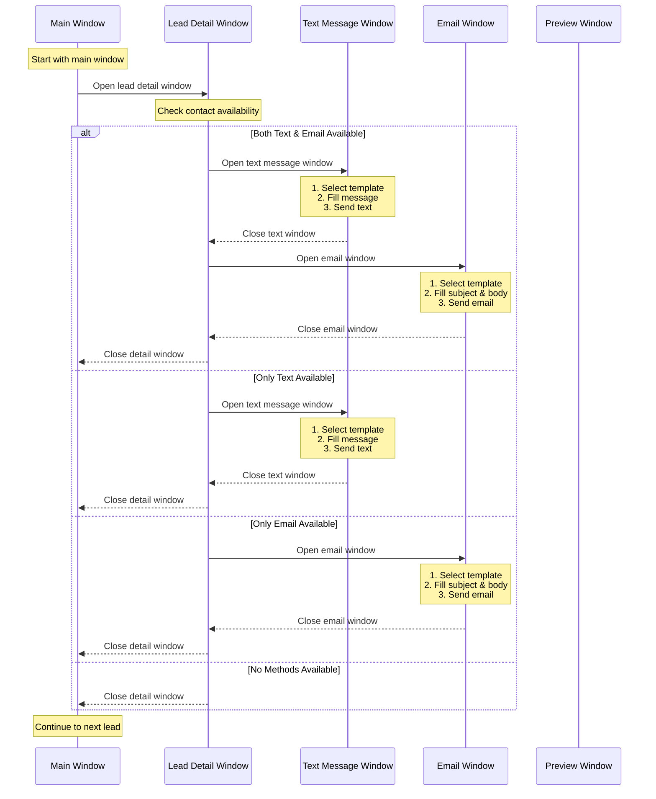

# Window Management Flow

The diagram above shows how the program manages different windows and tasks:

1. **Main Window**
   - Starting point for all operations
   - Contains list of leads to process
   - Returns here after each lead is processed

2. **Lead Detail Window**
   - Opens from main window
   - Checks contact availability
   - Determines which contact methods are available
   - Orchestrates opening of text/email windows as needed

3. **Text Message Window**
   - Opens if text messaging is available
   - Handles template selection
   - Fills in message content
   - Sends text message
   - Closes automatically after sending

4. **Email Window**
   - Opens if email is available
   - Handles template selection
   - Fills in subject and body
   - Sends email
   - Closes automatically after sending

5. **Preview Window** (when applicable)
   - May open temporarily for message preview
   - Automatically closes after confirmation

## Window Handling Rules

1. **Window Order**
   - Text messages are attempted first when both methods available
   - Email follows after text message completion
   - Each contact window must close before opening the next

2. **Error Handling**
   - If a window fails to open, the system logs the error and continues
   - If a window hangs, there are timeout mechanisms
   - Failed contact attempts are logged and reported

3. **State Management**
   - Each window handle is tracked
   - System maintains awareness of which window is active
   - Proper cleanup ensures no orphaned windows

4. **Contact Flow**
   - Contact methods are determined before any windows open
   - System won't open unnecessary windows
   - Windows are closed in reverse order of opening

## Task Sequence

1. **Initial Check**
   - Verify lead qualifies for contact
   - Check contact availability
   - Determine available methods

2. **Text Messaging (if available)**
   - Open text window
   - Select appropriate template
   - Fill message content
   - Send and verify
   - Close window

3. **Email (if available)**
   - Open email window
   - Select appropriate template
   - Fill subject and body
   - Send and verify
   - Close window

4. **Completion**
   - Log all contact attempts
   - Close all windows
   - Return to main window
   - Move to next lead 