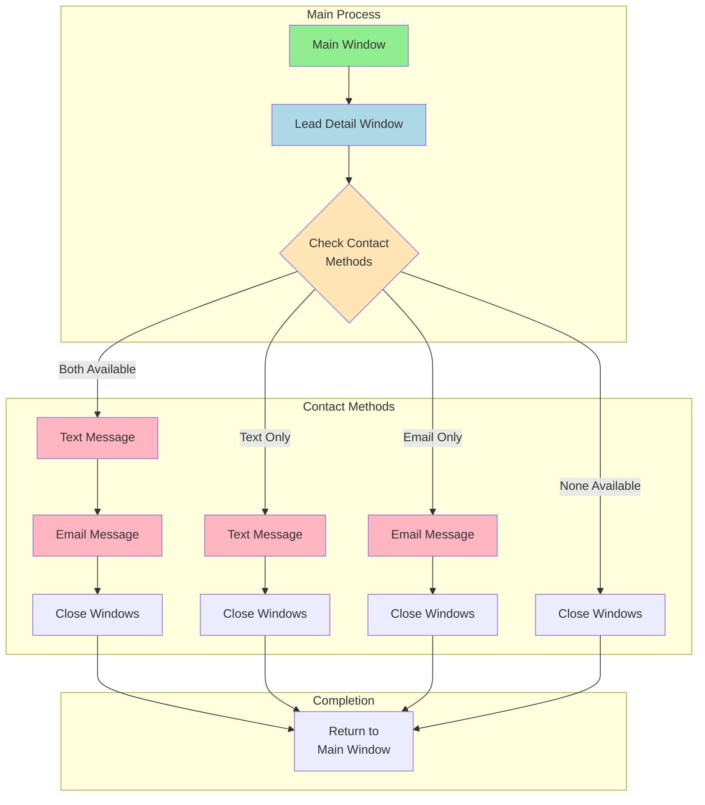

# Window Management and Task Flow

## Visual Flow


## Window Types and Handling

### 1. Main Window
- **Purpose**: Central control point
- **Handling**:
  - Stores main window handle on startup
  - Always returns here after lead processing
  - Used as reference point for window switching
  ```python
  main_window = driver.current_window_handle  # Store main window reference
  ```

### 2. Lead Detail Window
- **Purpose**: Shows lead information and contact options
- **Handling**:
  - Opens from main window
  - Stores new window handle
  - Performs availability checks
  ```python
  # Switch to new window
  detail_window = [h for h in driver.window_handles if h != main_window][0]
  driver.switch_to.window(detail_window)
  ```

### 3. Text Message Window
- **Purpose**: Text message composition and sending
- **Handling**:
  - Opens from detail window
  - Waits for elements to load
  - Closes after sending or on error
  ```python
  # Wait for text window and switch
  text_window = wait.until(EC.new_window_is_opened)
  driver.switch_to.window(text_window)
  ```

### 4. Email Window
- **Purpose**: Email composition and sending
- **Handling**:
  - Opens from detail window
  - Manages multiple input fields
  - Handles preview window if needed
  ```python
  # Wait for email window and switch
  email_window = wait.until(EC.new_window_is_opened)
  driver.switch_to.window(email_window)
  ```

## Window State Management

### Window Stack
1. Main Window (Bottom)
2. Lead Detail Window
3. Contact Windows (Top)
   - Text Message Window
   - Email Window
   - Preview Window (temporary)

### State Tracking
```python
class WindowState:
    def __init__(self):
        self.main_handle = None
        self.detail_handle = None
        self.contact_handle = None
        self.preview_handle = None
```

## Error Handling

### Window Opening Errors
- Timeout handling
- Retry logic
- Fallback procedures
```python
try:
    wait.until(EC.new_window_is_opened)
except TimeoutException:
    logging.error("Window failed to open")
    return False
```

### Window Closing Errors
- Force close if needed
- Cleanup procedures
- Return to known state
```python
def ensure_window_closed(handle):
    try:
        driver.switch_to.window(handle)
        driver.close()
    except:
        logging.warning(f"Window {handle} already closed")
```

## Safety Mechanisms

### Orphan Prevention
- Track all opened windows
- Verify window existence before actions
- Clean up on completion
```python
def cleanup_windows():
    current = driver.current_window_handle
    for handle in driver.window_handles:
        if handle != main_window:
            driver.switch_to.window(handle)
            driver.close()
    driver.switch_to.window(main_window)
```

### State Recovery
- Keep window handle history
- Maintain window hierarchy
- Recovery procedures for errors
```python
def recover_to_main():
    if main_window in driver.window_handles:
        driver.switch_to.window(main_window)
        return True
    return False
```

## Process Flow Details

### 1. Initial Setup
- Store main window handle
- Initialize window tracking
- Set up error handlers

### 2. Lead Processing
- Open detail window
- Check contact methods
- Plan contact sequence

### 3. Contact Execution
- Open appropriate windows
- Perform actions
- Verify success
- Close windows

### 4. Completion
- Verify all windows closed
- Return to main window
- Update lead status
- Prepare for next lead

## Color Key in Diagram
- 🟢 Green (Main Window): Starting/ending point
- 🔵 Blue (Detail Window): Information gathering
- 🌸 Pink (Action Windows): Contact execution
- 🟡 Yellow (Decision): Flow control points 