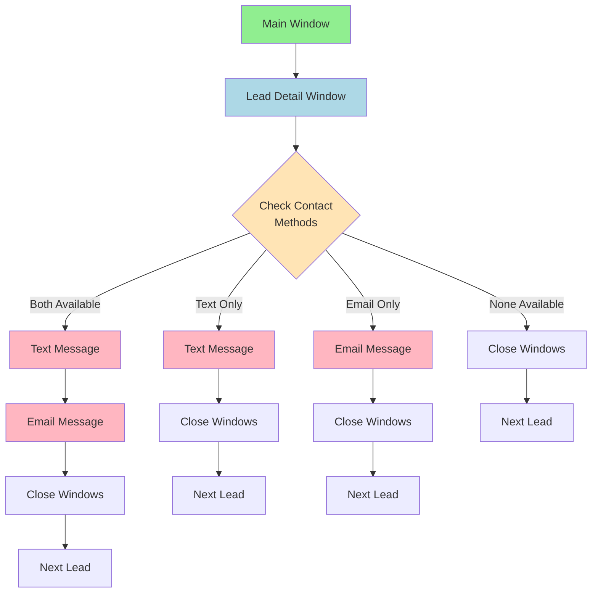

# Simple Window Flow

## Basic Process
1. Start at Main Window
2. Open Lead Detail
3. Check Available Contact Methods
4. Take Action Based on Available Methods:
   - Both: Do Text then Email
   - Text Only: Do Text
   - Email Only: Do Email
   - None: Skip Lead
5. Close All Windows
6. Move to Next Lead

## Color Key
- 🟢 Green: Starting Point
- 🔵 Blue: Detail Window
- 🌸 Pink: Action Windows
- 🟡 Yellow: Decision Point 